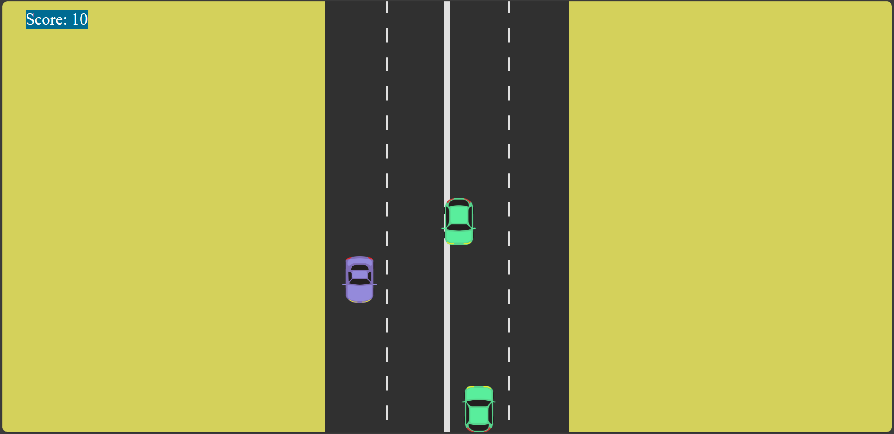
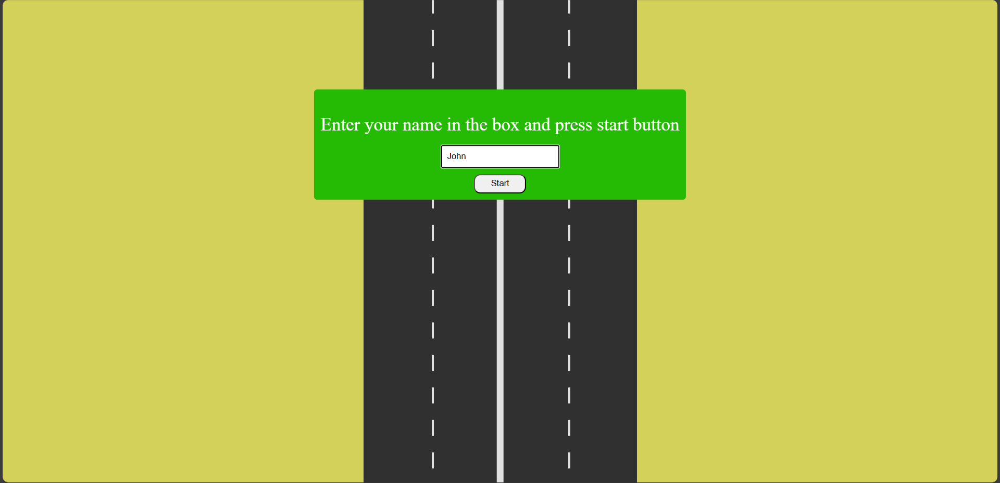
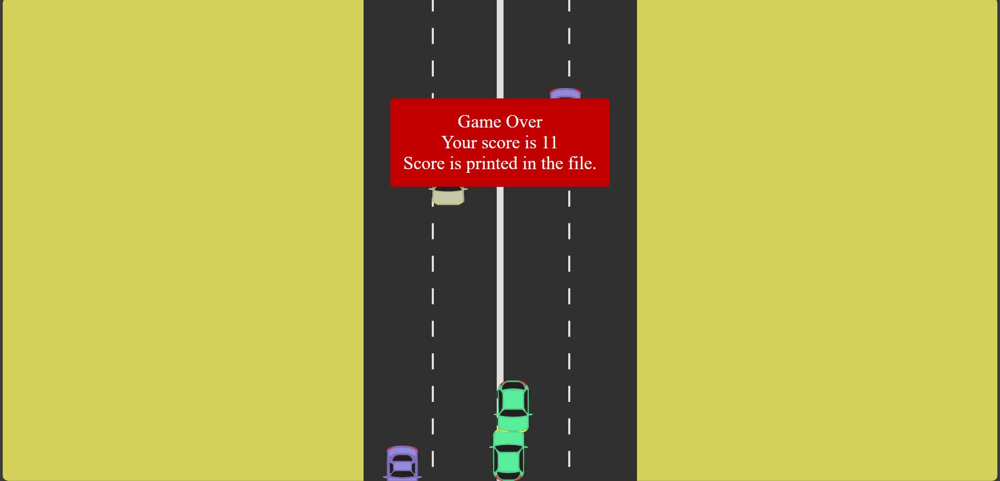
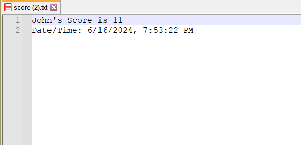

# Simple Car Game



A simple car racing game where you control a car to dodge incoming obstacles. The objective is to avoid collision for as long as possible to achieve a high score.

## Features

- **Player Name Input**: Enter your name before starting the game.
- **Game Controls**: Use the arrow keys (`←` and `→`) to move your car left and right.
- **Obstacle Avoidance**: Dodge cars that approach from the top of the screen.
- **Score Tracking**: Download your score as a text file with your name.

## How to Play

1. **Enter Your Name**: Type your name in the provided input box and press Enter.


3. **Start the Game**: Use the left and right arrow keys to maneuver your car and avoid collisions with oncoming cars.

   
5. **Game Over**: If your car collides with another car, the game ends.


7. **Download Score**: After the game ends, download your score as a text file with your name.


## Installation

Clone the repository and open `index.html` in your web browser to play the game locally.

```bash
git clone https://github.com/malakashashiranga/Car-game-in-JS.git

